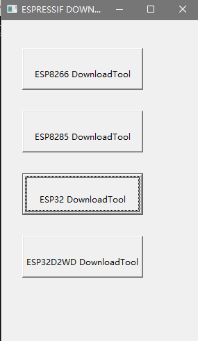
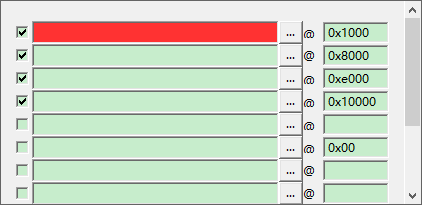
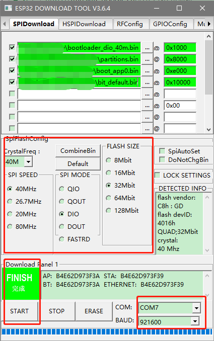

# Windows系统下烧录BPI-BIT(Webduino固件)

1. 双击打开`ESPFlashDownloadTool_v3.6.4.exe`选择`ESP32 DownloadTool`启动

2. 勾选四行选择框，分别在靠后一列的框内填入后面四个地址`0x1000`、`0x8000`、`0xe000`、`0x10000`，然后按照下面的对应关系分别选择对应文件：

|       Filename         | Address |
| ---------------------- |---------|
| bootloader_dio_40m.bin | 0x1000  |
| partitions.bin         | 0x8000  |
| boot_app0.bin          | 0xe000  |
| bit_default.bin        | 0x10000 |

3. 验证烧录相关设置：

|    Option   |        |
|-------------|--------|
| CrystalFreq | 40M    |
| SPI SPEED   | 40M    |
| FLASH SIZE  | 32Mbit |
| COM         | COMx   |
| BAUD        | 921600 |
> 其中`COMx`为您系统对板子分配的串口号

4. 点击`START`开始烧录，待上边的状态指示显示`Finish`后，**按住A键然后按背面的复位键，等待蜂鸣器发出声音，再放开两个按键**

#### 详情可参考下面图例：

